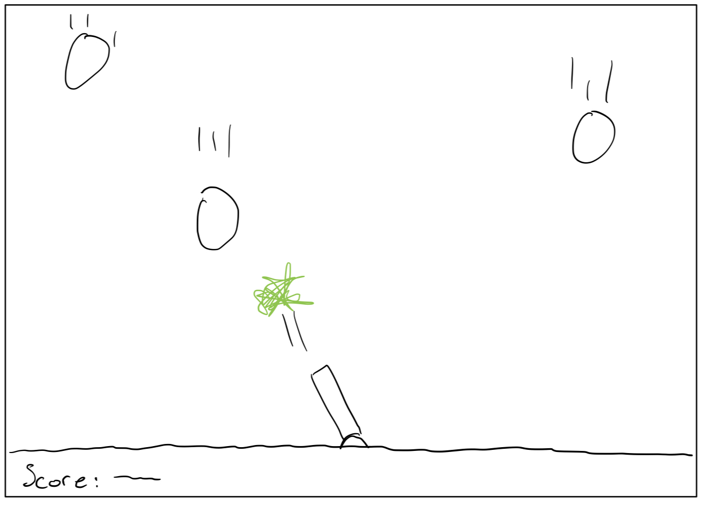

# Project Design Document: Golf Range Simulator
  * **Created at**: 09 October 2022
  * **Author**: Will Olson

## Project Concept

### 1. Player Control

You control a **missle launcher** in this **side view** game where **the mouse location** makes the player **adjust the aim of the missle launcher**.

### 2. Basic Gameplay

During the game, **astroids** appear from **top of the screen** and the goal of the game is to **shoot at the asteroids as they fall from the sky before they hit the earth**.

### 3. Sounds & Effects

There will be sound effects **of explosions when an asteroid is hit** and particle effects **of fireworks when the asteroid is hit as well**. (optional) There will also be **the same sound effects and the same particle effects of a different color when the asteroids hit the earth**.

### 4. Gameplay Mechanics

As the game progresses, **the asteroids appear in random locations and faster**, making it **harder as the game progesses**. (optional) There will also be **an easy, medium, and hard mode that determine the starting frequency of the asteroids**.

### 5. User Interface

The **score** will **increase** whenever **a projectile launched from the missle launcher hits an asteroid**. At the start of the game, the title **Not Another Asteroid Game!!** will appear and the game will end when **an asteroid hits the earth**.

### 6. Other Features

N/A

## Project Timeline

### Milestone #1

**Due:** 10/09

**Description:**
  - Full set of features built out
  - Background and ground images added

### Milestone #2

**Due:** 10/09

**Description:**
  - Game published

## Project Sketch

